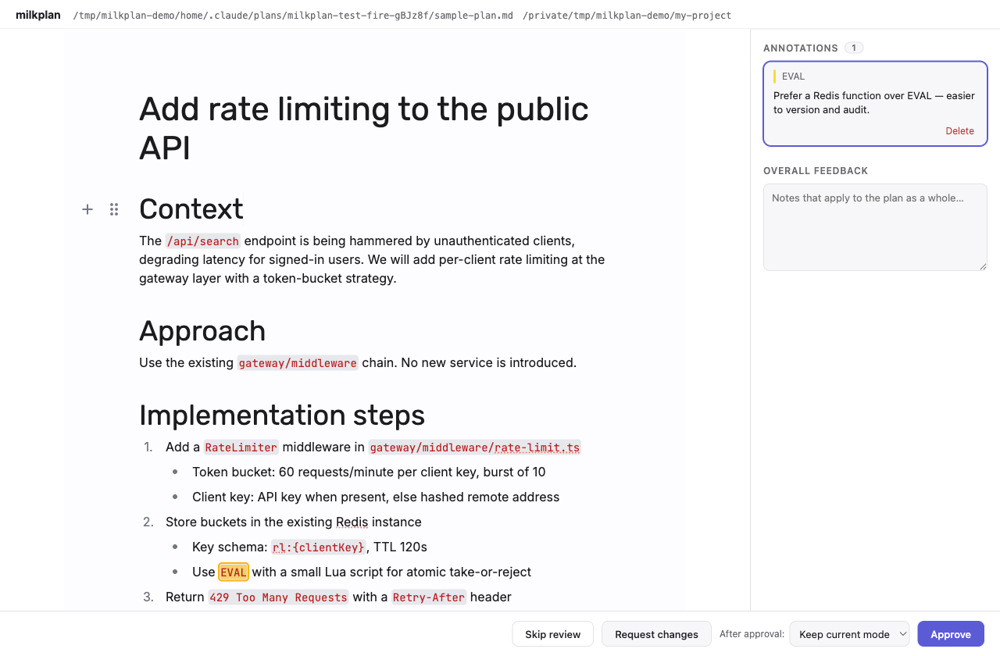

# milkplan

Review, **edit**, and annotate Claude Code plans in a [Milkdown](https://milkdown.dev)
WYSIWYG editor before approving them.

When Claude Code finishes planning and asks for approval (`ExitPlanMode`), milkplan
opens the plan in your browser instead of the terminal prompt:

- **Edit the plan directly** — WYSIWYG, in a real markdown editor. Approving sends
  your revised version back to Claude as the authoritative plan (the plan file on
  disk is updated to match).
- **Annotate** — select text, attach comments. Annotations survive concurrent edits
  (they are position-mapped, not text-matched) and orphaned comments keep their
  original excerpt.
- **Approve / Request changes / Skip** — approvals can carry implementation notes
  and optionally switch the session's permission mode (auto / accept edits /
  manual); rejections send your comments (anchored to quoted excerpts) back to
  Claude, which revises and resubmits. Skip falls back to the normal terminal
  prompt.
- **Compare rounds** — when Claude revises and resubmits after "Request
  changes", the next review shows a round badge and a "View changes" button:
  a read-only inline diff against any earlier submitted round of the same
  session.



Everything runs locally: an ephemeral HTTP server on `127.0.0.1` with a
per-review token, one process per review, no daemon. The review itself makes no
network calls (an `npx -y milkplan` hook command may contact the npm registry on
a cold cache).

## Requirements

- Node.js ≥ 20
- Claude Code with the `PermissionRequest` hook event (verified on v2.1.221;
  the stricter approval envelope required since v2.1.199 is handled
  automatically)
- An interactive session — headless `claude -p` never reaches plan approval
  (see Compatibility notes)

## Install

```sh
npm install -g milkplan   # or: use npx below without installing
milkplan init             # writes the hook into ~/.claude/settings.json
milkplan test-fire        # verify: your browser opens a sample plan review
```

`test-fire` exercises the full pipeline without a Claude Code session — if the
browser opens and deciding prints a JSON line to the terminal, the install
works.

Per-project installs come in two flavors:

- `milkplan init --project` targets `<cwd>/.claude/settings.local.json`, the
  machine-local settings file, because the hook command can embed absolute paths
  from your machine. init keeps it out of git for you (via `.git/info/exclude`),
  and warns if it is already tracked.
- `milkplan init --project --shared` writes a portable, version-pinned
  `npx -y milkplan@<version>` command into the committed
  `<cwd>/.claude/settings.json` so the whole team gets the hook. It refuses to
  run from a source checkout — a checkout's command only exists on your machine.
  Teammates need `npx` on their PATH, and Claude Code asks them to approve the
  project hook before it first runs.

Re-running `init` is safe: it refreshes a stale milkplan entry in the target
file (old node paths after a version-manager upgrade, an outdated `--shared`
version pin) instead of duplicating it. Hooks in _different_ settings files
stack, though — init warns when a sibling file also runs milkplan.

The hook entry looks like this (the `command` varies by mode — `--shared`
always writes the version-pinned `npx` form shown here; user and `--project`
installs may pin absolute local paths instead, which is why they live in
machine-local files):

```json
{
  "hooks": {
    "PermissionRequest": [
      {
        "matcher": "ExitPlanMode",
        "hooks": [
          {
            "type": "command",
            "command": "npx -y milkplan@0.1.0",
            "timeout": 86400
          }
        ]
      }
    ]
  }
}
```

Restart Claude Code after installing. The next time a plan needs approval, your
browser opens with the review UI.

To remove milkplan, clean up the hook entries first, then the package:

```sh
milkplan uninstall        # removes hooks from user + current project settings
npm uninstall -g milkplan
```

(Uninstalling only the package is not enough: a leftover `npx -y milkplan` hook
would silently re-download it from the registry on the next plan approval.)

Uninstalling does not delete review data: the plan text of past rounds stays in
`~/.claude/milkplan/history/` (see Plan history below) — remove that directory
yourself if you don't want to keep it.

## How it works

```
Claude Code ──ExitPlanMode──▶ PermissionRequest hook ──▶ milkplan CLI
                                  resolve plan (planFilePath → transcript → inline)
                                  serve review UI on 127.0.0.1:<random>#token=…
                                              │
                              you edit / annotate / decide
                                              │
              approve ──▶ allow (+ revised plan via additionalContext,
                          plan file updated on disk)
              request changes ──▶ deny (annotations + feedback → Claude revises)
              skip / any failure ──▶ passthrough to the terminal prompt
```

milkplan is **fail-open**: if the plan can't be located, the server can't start, no
browser can be opened, or you skip, it exits silently and Claude Code shows its
normal approval prompt. The hook `timeout` is the only thing that bounds how long a
review can stay open.

## Plan history

When you request changes, Claude revises and resubmits — a new review round in
the same session. milkplan records each round's plan as it was submitted, which
is what powers the "View changes" diff:

- **Where:** `~/.claude/milkplan/history/<session_id>.jsonl`, one round per
  line. Nothing else is stored — no annotations, no decisions.
- **What:** the submitted plan markdown only. Edits you make during review are
  written back to the plan file, so they surface as part of the _next_ round's
  submission — the diff shows everything that changed between two submissions,
  not only Claude's revision.
- **Noise control:** every round is run through the same markdown formatter
  before it is stored, and the diff ignores formatting-only differences such as
  renumbered list items and tight-vs-loose spacing — so a step inserted halfway
  down a numbered list highlights that step, not everything below it. Requesting
  changes also asks Claude to leave sections your feedback doesn't address
  untouched. A round whose only revision was formatting shows up as "no
  changes".
- **Retention:** the review UI is served the last 20 rounds of a session;
  history files untouched for about 30 days are pruned automatically.
- **Failures:** history is best-effort. If it can't be read or written,
  milkplan logs it and the review proceeds normally (the current round's diff
  falls back to in-memory history) — a history failure never blocks a review.

## Troubleshooting

Every hook invocation appends to `~/.claude/milkplan.log` — that file is the
first place to look.

- **Nothing popped up.** Restart Claude Code after `milkplan init` (hooks are
  read at startup), then check the log. If the hook fired, the log contains
  `review UI at http://127.0.0.1:<port>/#token=…` — open that URL manually. If
  the log has no entry at all, the hook never ran: confirm the entry exists in
  your settings file and that your Claude Code version has `PermissionRequest`
  hooks.
- **It stopped working after a Node upgrade.** Source-checkout installs pin the
  absolute path of the node binary; when a version manager (fnm/nvm) deletes
  that version, the hook dies silently. Re-run `milkplan init` — it refreshes
  stale entries in place.
- **Closed the tab before deciding.** Recover the URL from the log, or press
  Esc in the terminal to cancel the hook and use the native prompt. The hook
  timeout (24h by default) eventually falls back to the native prompt too.
- **Remote / headless (SSH, containers).** With no display and no `$BROWSER`,
  milkplan passes straight through to the terminal prompt rather than serving a
  UI nobody can reach. To review in a browser anyway, set
  `MILKPLAN_NO_BROWSER=1` so it serves and waits, then forward the port
  (`ssh -L <port>:127.0.0.1:<port> <host>`) and open the URL from the log
  locally. Setting `$BROWSER` works too, and keeps the automatic launch.
- **Skip vs closing the tab.** Skip hands control back to the terminal prompt
  immediately (annotations you typed are discarded); closing the tab leaves
  Claude Code waiting until Esc or the timeout.

## Development

```sh
pnpm install
pnpm dev          # UI against fixtures — no Claude Code needed
pnpm test         # vitest
pnpm build        # dist/ui (vite) + dist/cli.mjs (tsdown)
pnpm smoke        # test-fire: full hook loop against a synthesized session
```

`milkplan test-fire` exercises the real code path: it synthesizes a session
transcript, resolves it, starts the server, and opens the browser; the decision JSON
lands on stdout exactly as Claude Code would receive it.

Two environment variables affect the browser launch:

- `MILKPLAN_NO_BROWSER=1` — serve and wait, but never launch anything. This is
  the automation escape hatch; it never turns into a passthrough.
- `BROWSER` — the command to launch instead of the platform default. It is taken
  as a bare command and handed the URL as a single argument (no `%s` expansion,
  no colon-separated lists). Honored everywhere except native Windows.

## Compatibility notes

- **Interactive sessions only.** Headless runs (`claude -p`) do not expose
  `ExitPlanMode` at all — the model prints its plan and stops, so the hook never
  fires (verified empirically). This matches the product's intent: plan review
  needs a human at the keyboard.

- **WSL.** Your browser lives on the Windows side, so milkplan opens it there:
  `wslview` → `powershell.exe Start-Process` → `cmd.exe /c start`, trying the
  next one only when a launcher is not installed. That order holds even under
  WSLg, where `xdg-open` is kept as a last resort; set `BROWSER=xdg-open` to
  prefer a Linux browser instead. The review URL is loopback, which WSL2's
  default `localhostForwarding` (and WSL1's shared network stack, and mirrored
  networking mode) relays into the distro — with `localhostForwarding=false` in
  `.wslconfig` the browser opens but cannot reach the server.

- **No GUI browser.** On a box with no `DISPLAY`, no `WAYLAND_DISPLAY` and no
  `$BROWSER` — SSH sessions, containers — milkplan passes through to the
  terminal prompt instead of holding a port nobody can reach. Same if every
  launcher turns out to be missing (WSL with interop disabled, for instance).
  See Troubleshooting for reviewing over a forwarded port.

- Current Claude Code stores plans as files under `~/.claude/plans/` and passes
  the path in the hook payload (`tool_input.planFilePath`), which milkplan uses
  directly; it falls back to scanning the session transcript, and finally to the
  inline `tool_input.plan` older versions send.
- Claude does not re-read the plan file after approval, so edited plans are
  delivered through the hook's `additionalContext` (and the file is updated for
  consistency).

## License

MIT
